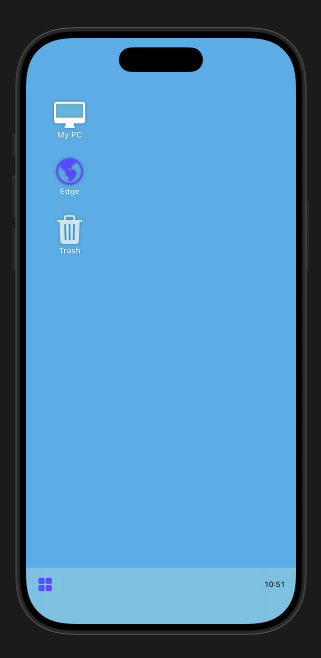
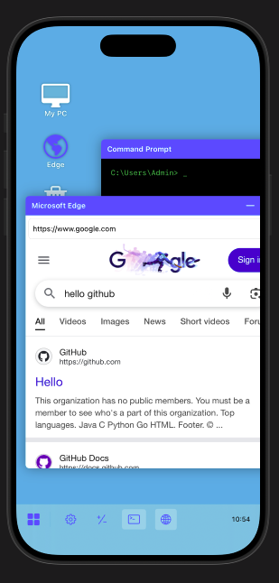

# Windows Simulator for iOS (SwiftUI)

A high-fidelity Windows OS simulator built entirely in **SwiftUI**. This project replicates the core user experience of a desktop operating system, including window management, a functional taskbar, a Start menu, and several built-in "system" applications.

## 🚀 Features

* **Windowing Engine**: Supports dragging, overlapping (Z-index management), minimizing, and closing windows.
* **Singleton App Logic**: Prevents duplicate processes; clicking an open app in the Start menu focuses the existing window.
* **Functional Taskbar**: Real-time clock, Start menu toggle, and active process tracking with "Restore from Minimize" capability.
* **System Apps**:
* **Edge Browser**: Real-time web browsing using `WebKit`.
* **Calculator**: Robust math engine supporting decimals and operations.
* **Notepad**: Integrated `TextEditor` for note-taking.
* **Settings**: Personalization hub to change desktop wallpaper colors.
* **Command Prompt**: Terminal-style UI with classic green-on-black aesthetic.

<table>
  <tr>
    <td></td>
    <td></td>
  </tr>
</table>

* **BSOD (Blue Screen of Death)**: A simulated system crash triggered via the Power menu.

---

## 🏗 Project Architecture

The project follows a modular SwiftUI pattern to ensure the compiler can handle the complex UI hierarchy.

### 1. Data Layer (`WindowModel`)

State is managed via a `WindowModel` struct which tracks:

* `AppType`: Enum defining the specific logic for the window.
* `Position`: `CGPoint` for draggable coordinates.
* `State`: Booleans for `isOpen` and `isMinimized`.

### 2. View Hierarchy

* **ContentView**: The "Kernel." It manages the global array of windows and handles the Z-stack layering.
* **WindowView**: A wrapper component that provides the title bar, drag gestures, and frame decoration.
* **App Dispatcher**: A `switch` statement inside the window body that renders the specific UI for the selected app.

---

## 🛠 Installation & Setup

1. Open **Xcode** (15.0+ recommended).
2. Create a new **iOS App** project using the **SwiftUI** interface.
3. Replace the contents of `ContentView.swift` with the provided source code.
4. Ensure `WebKit` is available in your build target (included by default in iOS).
5. Run on an **iPad Simulator** or **iPhone** (Landscape mode recommended).

---

## 📝 Code Maintenance

### Adding a New App

To add a new application to the simulator:

1. Add a new case to the `AppType` enum.
2. Update `getAppConfig` in `ContentView` to define the title and default color.
3. Create a new SwiftUI `View` struct for your app logic.
4. Add your view to the `switch` statement inside `WindowView`.
5. Add a button to the `StartMenuView` grid to launch the app.

### Handling Compiler Timeouts

SwiftUI can struggle with deeply nested `ZStack` views. If you encounter "Type-check expression in reasonable time" errors:

* Move sub-views into `private var` properties.
* Use `Group` to wrap conditional views.
* Ensure logical operations (like math or filtering) are kept in functions, not in the `body` property.

---

## 🐞 Troubleshooting

* **App "Freezes" in Xcode**: Check for accidentally set breakpoints (blue tags on line numbers). Delete them to resume execution.
* **Browser not loading**: Ensure the URL includes `https://`. Some sites may block embedding via `WKWebView`.
* **Windows overlapping**: The `bringToFront` function handles this by moving the active window to the end of the state array.
